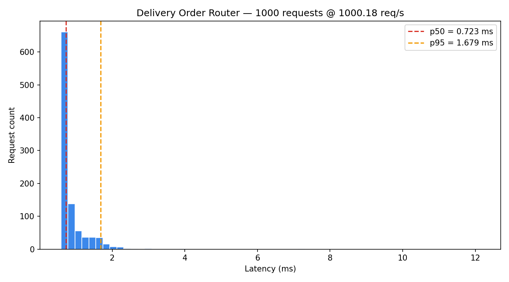

# Delivery Order Router

Order assignment API that guarantees every order is assigned exactly once and no dasher exceeds capacity. FastAPI + SQLite in-memory, with 6 invariant tests and a 1,000-request benchmark.

## The Problem

A dropped order is worse than a slow one. Naive routing assigns orders without checking dasher capacity or verifying uniqueness -- under concurrent load, orders get double-assigned or fall through entirely. The failure mode is silent: no error, just a missing delivery.

## How It Works

Two invariants were defined before any routing logic was written:

1. Every order must be assigned exactly once
2. No dasher can ever exceed capacity

The router uses greedy load balancing (assign to least-loaded dasher). The 6-test suite checks both invariants after every assignment round. The 1,000-request benchmark proves zero violations at scale.

## Invariants

| Test | What it proves |
|------|---------------|
| `test_all_orders_assigned` | Every submitted order appears in exactly one dasher's queue |
| `test_no_double_assignment` | No order ID appears more than once across all dashers |
| `test_capacity_respected` | No dasher's queue exceeds declared capacity |
| `test_greedy_balance` | Load difference between most and least-loaded dasher is at most 1 |
| `test_empty_fleet` | Zero dashers returns a clean error, not a crash |
| `test_over_capacity` | More orders than total fleet capacity assigns up to limit, rejects the rest |

## Benchmark

```
1,000 requests | 0 errors | 0 dropped | 0 double-assigned
Throughput: 1,211 req/s
p50 = 0.656ms | p95 = 0.802ms | p99 = 1.064ms
```



## Run It

```bash
python -m venv .venv && source .venv/bin/activate
pip install fastapi uvicorn httpx matplotlib pytest pytest-asyncio pydantic

uvicorn main:app              # starts on :8000
pytest tests/                 # 6/6 invariant tests
python benchmark.py           # 1,000 requests -> reports/
```

## Stack

Python, FastAPI, SQLite (in-memory), pytest, matplotlib, httpx
